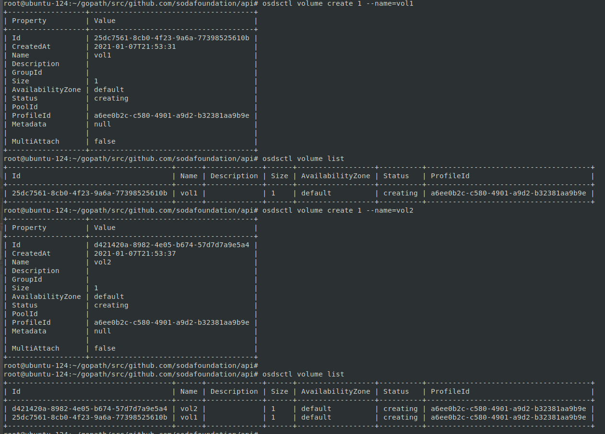

# Volume based replication with SODA Netapp driver PoC


# Introduction

This adds a new driver to SODA dock to support volume based replication.
###  Github:
SODA : [https://github.com/sodafoundation](https://github.com/sodafoundation)

SODA Dock: https://github.com/sodafoundation/dock


### Install SODA with Netapp Driver.

To test and use this POC, SODA should be installed with netapp basic driver. Please follow the below steps:

1. Cloned all the three repo(api controller and dock):

```
git clone https://github.com/sodafoundation/api.git
git clone https://github.com/sodafoundation/controller.git
git clone https://github.com/sodafoundation/dock.git
```

2. Add the driver codes in dock repo:

 $GOPATH/dock/contrib/drivers/netapp/ontap/dock/contrib/drivers/netapp/ontap/replication.go

 $GOPATH/dock/contrib/drivers/netapp/ontap/dock/contrib/drivers/netapp/ontap/cli.go


 3. Modify replication_driver.go file and add for netapp driver in dock repo.

 vim contrib/drivers/replication_drivers.go

 a. add import path
 ```
 import (
         "github.com/sodafoundation/dock/contrib/drivers/netapp/ontap"
)
```
b. NetappDRBDDriverType drivertype
```
 func InitReplicationDriver(resourceType string) (ReplicationDriver, error) {
        var d ReplicationDriver
        switch resourceType {
       case driversConfig.NetappDRBDDriverType:
               d = &ontap.ReplicationDriver{}
               break
        case driversConfig.DRBDDriverType:
                d = &drbd.ReplicationDriver{}
                break
```

4. Add the constansts variable in dock repo

  vim contrib/drivers/netapp/ontap/constants.go
```
  const (
     StorageDriverName = "netapp_ontap_san"
  )
```

5. Install the soda using devsds script

 a. run the ./install/devsds/install.sh from api replication

 ```
 Example:
 root@root1-Latitude-E7450:~/gopath/src/github.com/sodafoundation/api# ./install/devsds/install.sh
 ```


6. Now manually netapp driver can be added.

 a. kill the running osdsdock process
  ```
  kill -9 <dock process id>
  ```

7. Modify the opensds.conf file to add netapp_ontap_san driver.
vi /etc/opensds/opensds.conf
```
[netapp_ontap_san]
name = netapp_ontap_san
description = netapp_ontap_san
driver_name = netapp_ontap_san
config_path = /etc/opensds/driver/netapp_ontap_san.yaml
```
```
enabled_backends = lvm,nfs,netapp_ontap_san
```

8. Add the netapp_ontap_san.yml to /ete/opensds/driver directory

 netapp_ontap_san.yml

 ```
backendOptions:
  version: 1
  username: username
  password: password
  storageDriverName: "netapp_ontap_san"
  managementLIF: 127.0.0.1
  dataLIF: 127.0.0.1
  svm: svm_name
  igroupName: "opensds"
pool:
  aggr_soda:
    storageType: block
    availabilityZone: default
    multiAttach: true
    extras:
      dataStorage:
        provisioningPolicy: Thin
        compression: false
        deduplication: false
      ioConnectivity:
        accessProtocol: iscsi
```
9. start the osdsdock process from dock repo
```
./build/out/bin/osdsdock .&
```

#### HOW TO TEST

##### 1. Firts check netapp dock is available

  osdsctl dock list

  

##### 2. Create two volumes

osdsctl volume create vol-size --name=vol-name



##### 3. Create replication using both volumes

  use below API:

  curl -X POST -H "Content-Type: application/json" -d '{"name":"replication-demo", "description":"This is just for test", "primaryVolumeId":"25dc7561-8cb0-4f23-9a6a-77398525610b", "secondaryVolumeId":"d421420a-8982-4e05-b674-57d7d7a9e5a4", "availabilityZone":"default", "replicationPeriod":60, "replicationMode":"sync", "profileId":"a6ee0b2c-c580-4901-a9d2-b32381aa9b9e"}' -url http://127.0.0.1:50040/v1beta/e93b4c0934da416eb9c8d120c5d04d96/block/replications -v

  

##### 4. Check replication is created and available

osdsctl volume replication list


##### 5. The created replication is now available on netapp backened

